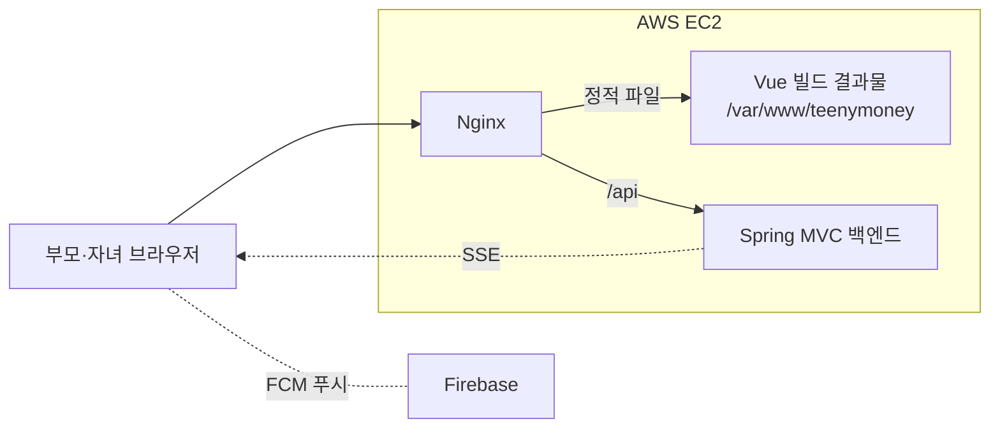

# 티니머니 프론트엔드 (TeenyMoney FrontEnd)

부모와 자녀가 함께 금융 습관을 만드는 가족 금융 교육 서비스 **티니머니**의 프론트엔드 저장소입니다.

부모가 일방적으로 소비를 통제하는 대신 자녀가 퀘스트, 금융 활동, 소비 경험으로 신뢰를 쌓고
금융 자율성을 조금씩 넓혀 가도록 돕는 것을 목표로 합니다. 부모와 자녀가 같은 앱에 로그인하면
역할에 맞는 화면으로 나뉩니다.

| 항목 | 내용 |
| --- | --- |
| 과정 | KB IT's Your Life 7기 최종 프로젝트 (22회차 4팀) |
| 개발 기간 | 2026년 7월 ~ 8월 |
| 팀 구성 | 6명 (Backend 4, Frontend 2) |
| 개발 통합 서버 | https://www.teenymoney.kro.kr |
| 백엔드 저장소 | [TeenyMoney-Backend](https://github.com/KB-PJT-CLASS22-TEAM4/TeenyMoney-Backend) |

## 주요 화면

### 부모

| 영역 | 화면 |
| --- | --- |
| 가족 연동 | 연동 코드 발급, 연동 완료, 자녀 목록과 자녀 상세 |
| 지갑·용돈 | 홈, 거래내역, 카드 충전, 용돈 보내기, 정기 용돈 설정, 결제 수단 변경 |
| 소비 관리 | 유해 업종 카테고리 설정, 사용처 목록, 오늘만 허용 한도, 자녀 요청 목록 |
| 금융상품 | 자녀 맞춤 상품 만들기, 가입 승인, 완료 상세 |
| 퀘스트 | 퀘스트 목록·상세, 인증 승인과 반려 |
| 성장 확인 | 자녀 티니점수, 자녀 머니 리포트, 자녀 거래내역 |
| 기타 | 알림, 마이페이지(결제 비밀번호, 약관), FAQ |

### 자녀

| 영역 | 화면 |
| --- | --- |
| 가족 연동 | 연동 코드 입력, 확인, 완료 |
| 지갑·결제 | 홈, 거래내역, QR 스캔·QR 코드 결제, 결제 비밀번호 설정·변경 |
| 오늘만 허용 | 요청, 확인, 수정 |
| 금융상품 | 신규 상품, 내 상품, 가입·해지, 만기·중도해지·상환 상세 |
| 퀘스트 | 퀘스트 목록과 상세, 인증 제출 |
| 성장 확인 | 티니점수와 등급, 머니 리포트 |
| 기타 | 알림, 마이페이지(약관), FAQ |

공통으로 로그인, 회원가입, 온보딩 화면이 있고 FCM 푸시와 SSE 실시간 이벤트로 알림과 화면 상태를 갱신합니다.

## 기술 스택

| 구분 | 기술 |
| --- | --- |
| Framework | Vue 3.5, Vite 8 |
| 상태·라우팅 | Pinia 3, Vue Router 5 |
| HTTP | Axios |
| UI | Bootstrap 5.3 |
| 알림 | Firebase 12 (Cloud Messaging), Server-Sent Events |
| QR | qrcode.vue, vue-qrcode-reader |
| 기타 | Moment |
| 테스트 | Node.js 내장 테스트 러너 (`node --test`) |
| 배포 | GitHub Actions, AWS EC2, Nginx |

## 시스템 구성



## 프로젝트 구조

```text
.
├── .github/                 # Issue·PR 템플릿, CI·배포 workflow
├── .env.example             # 환경변수 예시
├── docs/task-notes/         # 작업 메모
└── frontend/
    ├── index.html
    ├── vite.config.js       # @ 경로 별칭, 개발용 /api 프록시
    ├── src/
    │   ├── api/             # 도메인별 API 모듈 (auth, families, wallet, payment, quest 등)
    │   ├── assets/          # 이미지, 아이콘, 마스코트, 폰트
    │   ├── components/      # 공통 컴포넌트와 자녀 화면 컴포넌트
    │   ├── composables/     # 메뉴, 알림 모달, SSE 구독 등 재사용 로직
    │   ├── constants/
    │   ├── pages/           # Parents, Child, 공통 페이지
    │   ├── router/          # 라우트 정의
    │   ├── stores/          # Pinia 스토어
    │   ├── styles/
    │   ├── utils/
    │   ├── firebase.js      # FCM 초기화
    │   └── main.js
    └── test/                # node:test 기반 단위 테스트
```

## 실행 방법

### 요구 사항

- Node.js `^20.19.0` 또는 `>=22.12.0` (CI는 Node.js 22 사용)

### 설치와 개발 서버

```bash
git clone https://github.com/KB-PJT-CLASS22-TEAM4/TeenyMoney-FrontEnd.git
cd TeenyMoney-FrontEnd/frontend
npm install
npm run dev
```

개발 서버는 `vite.config.js`의 프록시로 `/api` 요청을 개발 통합 서버(`https://www.teenymoney.kro.kr`)에 전달합니다.
로컬 HTTP에서도 Refresh Token 쿠키가 저장되도록 프록시가 응답 쿠키의 `Domain`, `Secure` 속성을 조정합니다.

### 테스트와 빌드

```bash
npm test          # node --test test/
npm run build     # dist/ 생성
npm run preview   # 빌드 결과 미리보기
```

### 환경변수

루트의 `.env.example`을 참고해 `frontend/.env`를 만듭니다. 실제 `.env` 파일은 커밋하지 않습니다.

| 변수 | 설명 |
| --- | --- |
| `VITE_API_BASE_URL` | 백엔드 API 주소. 개발 서버에서는 프록시가 처리하므로 비워도 되고, 빌드·배포 시에는 필요합니다 |
| `VITE_LOGIN_VIDEO_BASE` | 로그인 화면 배경 영상의 CloudFront 주소(끝에 `/` 없음). 비우면 정적 이미지로 대체합니다 |

## 백엔드 연동

- 인증은 백엔드의 JWT와 Refresh Token Cookie를 사용합니다. 로그인, 재발급, 로그아웃 요청에는 `GET /api/v1/auth/csrf`로 받은 토큰을 `X-XSRF-TOKEN` 헤더로 보냅니다.
- 실시간 이벤트는 `POST /api/v1/sse/ticket`으로 1회용 티켓을 받은 뒤 `GET /api/v1/sse/subscribe`로 구독합니다.
- API 명세는 [Swagger UI](https://www.teenymoney.kro.kr/swagger-ui.html)에서 확인합니다.

자세한 규칙은 백엔드 저장소의 [프론트엔드 API 연동 안내](https://github.com/KB-PJT-CLASS22-TEAM4/TeenyMoney-Backend/blob/dev/docs/FRONTEND_DEV.md)를 참고합니다.

## CI/CD

| Workflow | 실행 시점 | 하는 일 |
| --- | --- | --- |
| [CI](.github/workflows/ci.yml) | `dev`, `main` 대상 PR, `main` push, 수동 실행 | 필수 파일 확인, 실제 `.env` 커밋 차단, `npm ci`와 `npm run build` |
| [Deploy development](.github/workflows/deploy-dev.yml) | `dev` push, 수동 실행 | 빌드 결과물을 EC2에 배포하고 실패 시 이전 버전으로 자동 복원 |

운영 방법은 [GitHub Actions 운영 문서](.github/workflows/README.md)를 참고합니다.

## 협업 규칙

- `main`, `dev`에는 직접 push하지 않고 작업 브랜치에서 Pull Request로 병합합니다.
- PR은 CI(`repo-policy`, `frontend`)와 코드 리뷰를 통과해야 병합합니다.
- 커밋 메시지는 `feat`, `fix`, `refactor`, `docs`, `style`, `test`, `chore` 접두어를 씁니다.
- UI를 바꾸는 PR에는 스크린샷을 첨부합니다.
- 실제 `.env`, API 키, 개인정보가 포함된 데이터는 저장소에 올리지 않습니다.

## 팀

| 역할 | GitHub | 주요 담당 |
| --- | --- | --- |
| 팀장 · Backend | [@we5046](https://github.com/we5046) | 프로젝트 총괄, 저장소·CI/CD 설정, 온보딩과 SSE 연동 |
| Frontend | [@yxngbxyxn1003](https://github.com/yxngbxyxn1003) | 부모 화면, 회원가입·로그인 |
| Frontend | [@soobin-shin](https://github.com/soobin-shin) | 자녀 화면 |
| Backend | [@wjdgh123](https://github.com/wjdgh123) | 금융상품, 티니점수 |
| Backend | [@dkzndkqh](https://github.com/dkzndkqh) | 지갑·충전, 용돈, 머니 리포트 AI 분석, AI 챗봇 |
| Backend | [@kimjm9841](https://github.com/kimjm9841) | 카테고리 결제 정책, 오늘만 허용, 결제, 알림 |

## 프로젝트 성격

KB IT's Your Life 교육 과정의 팀 프로젝트로 제작했습니다. 별도의 오픈소스 라이선스는 부여하지 않았습니다.
